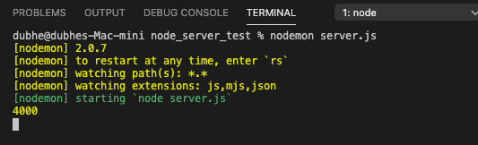
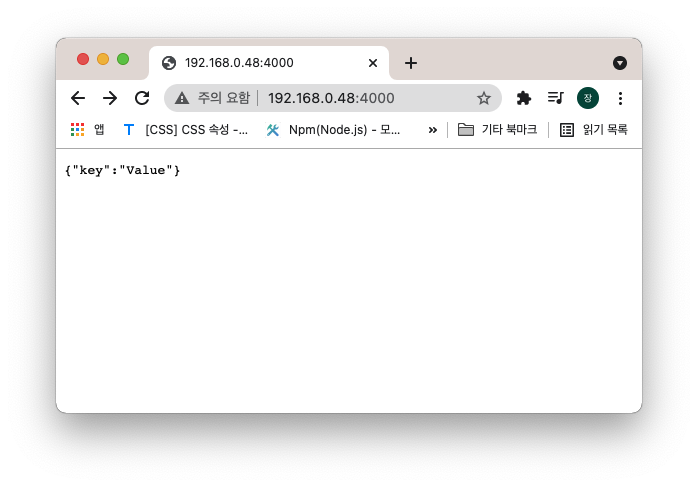
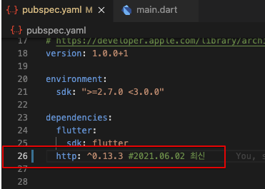
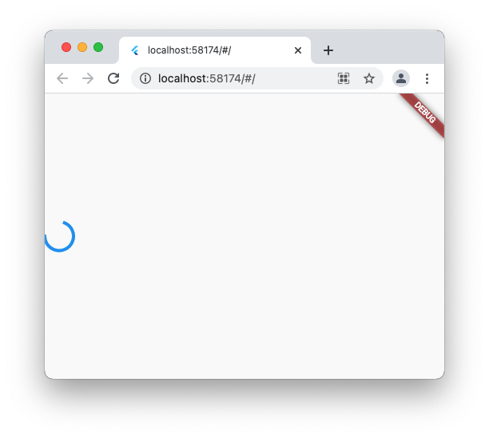
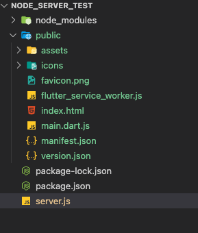
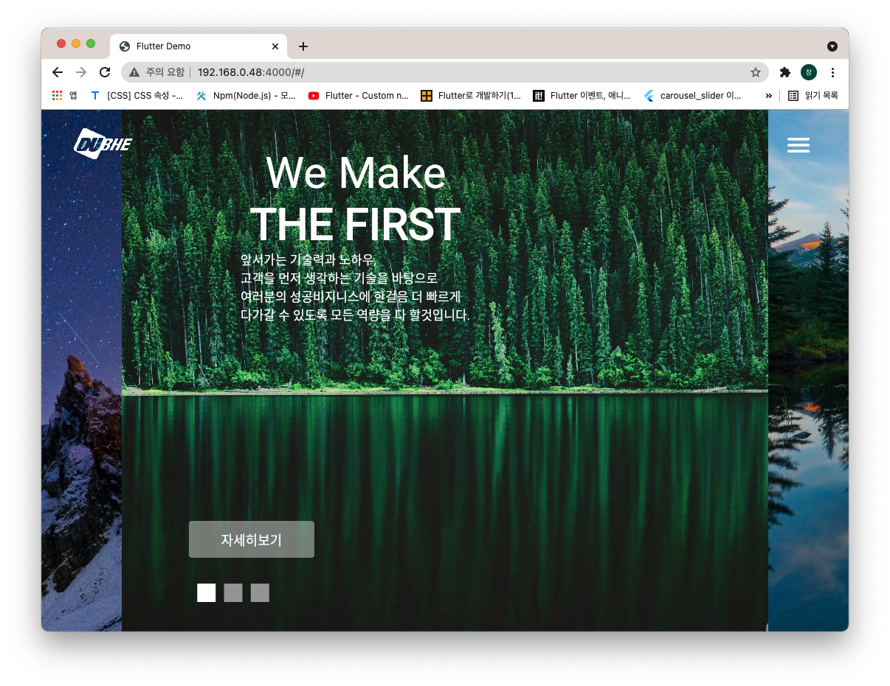

노드JS로 서버구축하기 동영상 강의 아래링크  
https://www.youtube.com/watch?v=a8D_8VqADbo&list=PLIKnSA4GMR4Ow3vkUMUw7FaCrXL9CDOmT&index=3  
플러터로 노드JS 사용하기 아래링크  
http://www.incodom.kr/Flutter/http  
nodejs 설치 페이지 아래링크  
https://nodejs.org/ko/download/  
Flutter Doc 문서 http 라이브러리 아래링크   
https://pub.dev/packages/http       
로컬노드서버에 css,html 적용  아래링크  
https://webisfree.com/2017-10-30/nodejs%EB%A1%9C-%EA%B0%84%EB%8B%A8%ED%95%9C-%EC%9B%B9%EC%84%9C%EB%B2%84-%EA%B5%AC%EC%B6%95%ED%95%98%EB%8A%94-%EB%B0%A9%EB%B2%95-%EB%B0%8F-%EC%98%88%EC%A0%9C%EB%B3%B4%EA%B8%B0

 
   
## 내용 목록  
[node js 설치하기](#노드-js-설치)   
[express, nodemon 설치](#express-nodemon-설치)  
[node 서버 소스 생성](#node-js-서버-소스-입력)        
[Flutter http 라이브러리](#flutter-http-라이브러리)  
[실행](#플러터에-실행-결과)  

 

##   (추가 수정) 내용 목록
[플러터 웹 빌드 로컬노드서버에 올리기](#플러터-웹-빌드-로컬노드서버에-올리기)  
[노드 로컬 서버 접속하기](#노드-로컬-서버의-웹에-접속하기)

  

# 노드 js 설치
node js 사이트에 접속해 릴리즈버전으로 다운받는다.  
기본값으로 설치 계속 진행후 완료.  

터미널에 node -v 를 입력하고 버전 잘 뜨면 설치작업은 끝. 

vscode 에디터를 사용하여 (그외도가능) nodejs 서버를 구현해보자 

  

# express, nodemon 설치  
1.  vscode 에서 상단에 Terminal을 눌러 newTerminal을 생성해주자.  
2.  생성된 터미널에 아래 명령문을 터미널에 입력하여 모듈 생성 (node_modules, package.json)  
~~~  
 > npm install express --save
 > npm install nodmon --save 
~~~ 

> 문제 발생  
 npm install nodemon 설치명령을 실행하여 다운받고 nodemon파일이 모듈안에 존재함을 확인하였으나 nodemon 명령어 실행시 not found nodemon 이란 오류발생  
 해결방안 참고 아래링크   
https://www.inflearn.com/questions/156199      
3. 터미널에 npm install -g nodemon 입력 단, 맥이나 우분투일경우 맨앞에 sudo 추가해 붙여 관리자 권한 명령으로 실행 
4. nodemon의 설치가 완료되면 node_modules/nodemon 있는걸 확인  

  

# node js 서버 소스 입력

server.js 파일 생성 

~~~js
//express 를 import (적용)
var express=require('express'); 
//express를 실행시키고 별칭으로 app
var app=express();

//json 요청받겟다
app.use(express.json());

app.get("/",(req,res)=>{
    res.json({
        "key":"Value"
    });
});

//4000포트 사용 
//포트는 0~65535 까지 존재
//단, 0~1023 까지는 접근불가(ex http 포트는 80으로 고정 ) 그외의 포트 사용가능
app.listen(4000,(err)=> {
    //실행했을때 터미널에 4000 찍혀야함
    console.log(4000);
});
~~~

  

## 실행결과 
터미널에 아래 명령문 입력 (nodejs있는 파일에서)  
~~~
 > nodemon server.js
~~~
    

  

nodemon 명령어 종료는 컨트롤+c 또는 exit 입력

생성된 ip서버로 접속해 보기  

크롬 주소창에 본인피씨ip:포트/ 입력  

  

  

# Flutter http 라이브러리 

https://pub.dev/packages/http 를 참고하여 http 버전 확인  
pubspec.yaml > dependencies 에 라이브러리 추가  

 

  

  

## 소스 작성
 ~~~dart
import 'package:flutter/material.dart';
import 'package:http/http.dart' as http; 

void main() {
  runApp(MaterialApp(
    home: MyApp(),
  ));
}

class MyApp extends StatefulWidget {
  @override
  _MyAppState createState() => _MyAppState();
}

class _MyAppState extends State<MyApp> {
  Future fetch() async {
    var res = await http
        .get(Uri.parse("http://192.168.0.48:4000/"));
    return res.body;
  }

  @override
  Widget build(BuildContext context) {
    return Scaffold(
      body: SafeArea(
        child: Column(
          mainAxisAlignment: MainAxisAlignment.center,
          children: [
            FutureBuilder(
              future: this.fetch(),
              builder: (context, snap) {
                if (!snap.hasData) return CircularProgressIndicator();
                return Text(
                  snap.data.toString(),
                );
              },
            ),
          ],
        ),
      ),
    );
  }
}
~~~

  

  

 # 플러터에 실행 결과

   

## 결과물 확인하고 생각드는점... 
 
 위와같은 결과는 에러다..   
 ~~~dart
  if (!snap.hasData) return CircularProgressIndicator();
                return Text(
                  snap.data.toString(),
                );
 ~~~
 리턴을 true로 받아 동그란프로세스가 동작된다..예제대로라면 위의  http://192.168.0.48:4000/ 를접속햇을때의 화면에 출력된 {"key":"Value"} 가 출력되줘야하는데 uri링크가 https 프로토콜타입이 아니라 그럴지도 모르겟다..?? 위소스같은경우는 노드서버에 웹을 띄운다긴보단 노드서버의 데이터를 가져오는느낌인 예제인듯싶다. 
 
 플러터 웹앱 개발 -> 플러터 웹 빌드 -> 노드로컬서버 생성 -> 아마존 배포 순? 진행 맞나영  

  

 ---- 추가 수정 ---- 

  

# 플러터 웹 빌드 로컬노드서버에 올리기 
선행 준비 작업 
- 플러터 웹 빌드 파일 준비. 빌드명령문은 아래와 같다 (해당 프로젝트 터미널에서 실행)
  ~~~
   > flutter build web   
  ~~~

- 로컬 노드 서버 준비 (위의 express, nodemon 설치 방법 참고 [클릭하면 바로이동](#express-nodemon-설치))
- 로컬 노드 서버 파일경로에 public 이라는 폴더생성 후 빌드파일 추가 

 

아래와 같이 주요파일이 존재하면 준비 끝  
- node_moudules, package-lock.json (express 설치하면 자동 생성)
- public/build 파일 (플러터 빌드 파일)
- server.js (노드 서버 소스)  
 
   

  

## 로컬 노드 서버 소스 입력

~~~js
//express 를 import (적용)
var express=require('express'); 
//express를 실행시키고 별칭으로 app
var app=express();

//json 요청받겟다
app.use(express.json());
//정적인 파일 사용
app.use(express.static('public'))

app.get('/', function(req,res){
    res.sendFile(__dirname+"/public/index.html")
})

app.get('/main', function(req,res){
    res.sendFile(__dirname+"/public/index.html")
})

//4000포트
app.listen(4000,(err)=> {
    console.log(4000);
});
~~~

 

작성 후 노드서버 열기
~~~
 > nodemon server.js 
~~~ 

실행하면 터미널에 server.js가 실행된걸 확인할수있음.

  

# 노드 로컬 서버의 웹에 접속하기

시스템 -> 네트워크 -> ipv4 확인   

192.168.0.48:4000/index.html/   
주소에 접속

 

내가 생성한 4000포트로 접속 가능! 

  

----

느낀점 2021.6.3

flutter의 http 라이브러리는 서버의 데이터를 가져올때 사용하는것이고, 노드서버에 웹을 띄우는건 빌드 파일들을 nodejs프로젝트 경로에 폴더로 추가하고 js소스를 sendFile로 index.html을 받아오면 된다.

결론적으론 맨상단위의 [예제방법](#플러터에-실행-결과)은 노드서버에 웹 올리기랑은 관련 없다. 그리고 http라이브러리는 사용하지않는다. 
